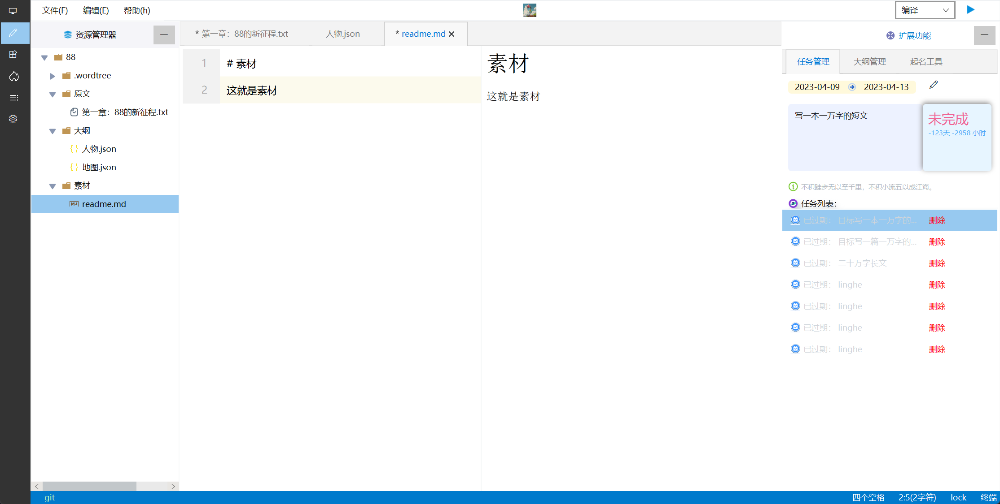
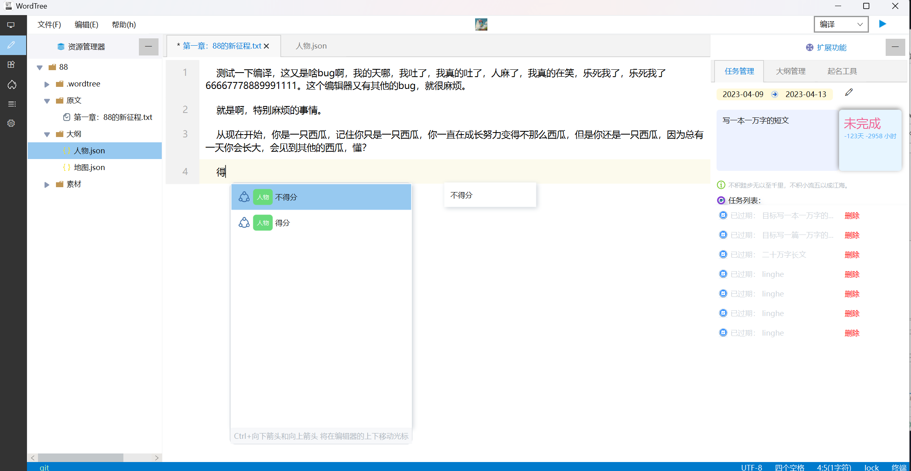
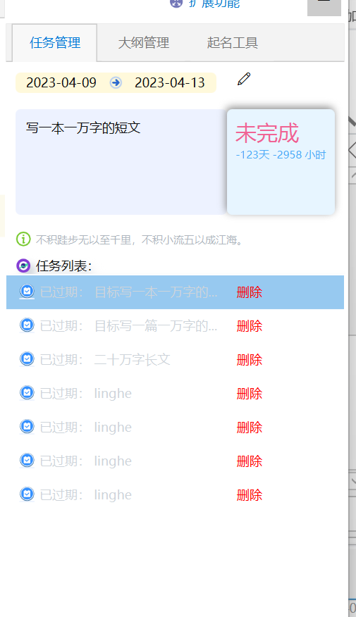
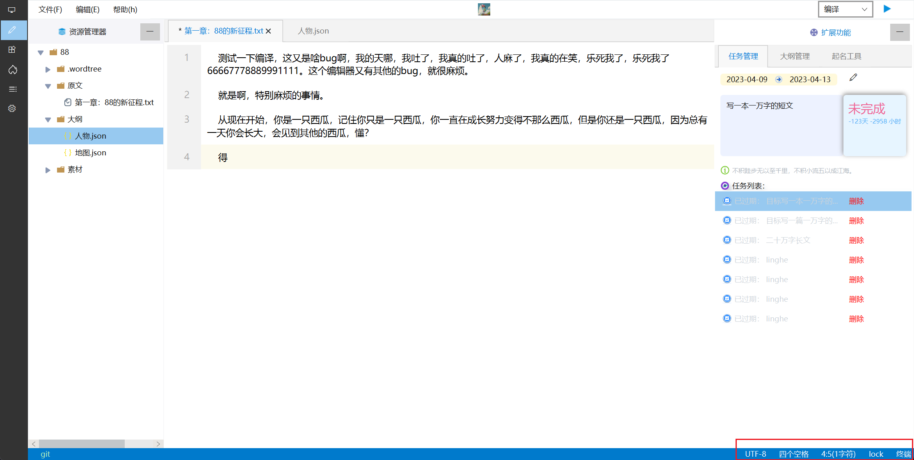
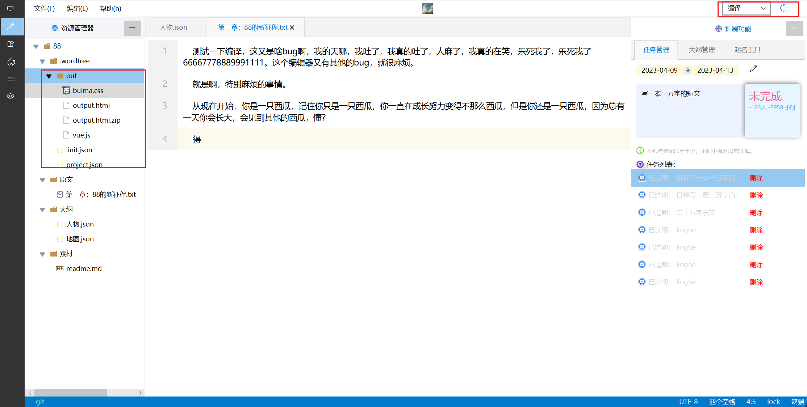

[//]: # (    )
    
    
    
    
    

WordTree核心功能预览:

## 保存素材的操作，这个可能需要富文本编辑器

## 人物关系书

## map地图世界观创建

## 可能还需要人物会动起来（笑）

## 最基本的双向链接操作

## 文本提示功能

## 任务管理

## 时间计算，码字统计，统计工作

## 集成插件系统  
  
## 编译功能  
可将项目转化为html文件  
   

版本迭代：  
0.1 beta 实现基本的编辑功能，和一些功能的预览  
0.2 beta 完善0.1beta的功能  
0.3 beta 对整个项目进行MVC重构   2023/8/14  

