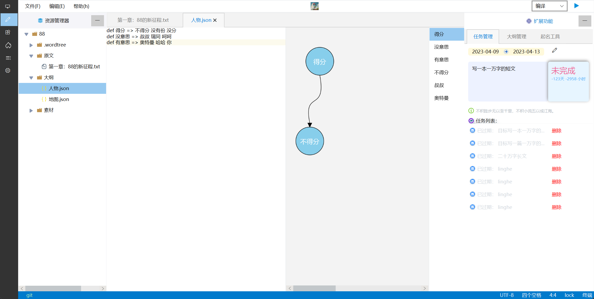

## 项目意义：  
我一直以来都有一个想当作家的梦想，在开始做这个软件的时候，我认真的调研了市场上面的几款写作软件，要么充斥着大量的广告，要么不够强大功能不够全面，要么不是中文或者说写作领域的软件。
总之，这个市场太缺乏活力了，这个市场太死气沉沉了。  
如此庞大的市场，却缺少一款杀手级软件，所以我打算做这个产品。  
## 项目架构
项目采用C/S架构，及传统的桌面端软件架构，使用JavaFx技术实现项目的跨平台，采用gradle对项目进行依赖管理。
最终目标是以VsCode为参考对象，实现一款可自由扩展，有着巨量基础功能的超级文本IDE（文本集成开发环境）。
具体功能要求实现：实现文件树、实现编辑区不仅仅能编辑代码还能进行小说的编辑任务、实现小说功能提示功能、实现人物具体编写功能、实现每日数据收集汇总功能、实现插件的管理与扩展功能。  
  

# WordTree核心功能预览:

## 保存素材的操作，这个可能需要富文本编辑器

## 人物关系书

## map地图世界观创建

## 可能还需要人物会动起来（笑）

## 最基本的双向链接操作

## 文本提示功能

## 任务管理

## 时间计算，码字统计，统计工作

## 集成插件系统  
  
## 编译功能  
可将项目转化为html文件  
   

版本迭代：  
0.1 beta 实现基本的编辑功能，和一些功能的预览  
0.2 beta 完善0.1beta的功能  
0.3 beta 对整个项目进行MVC重构   2023/8/14  

